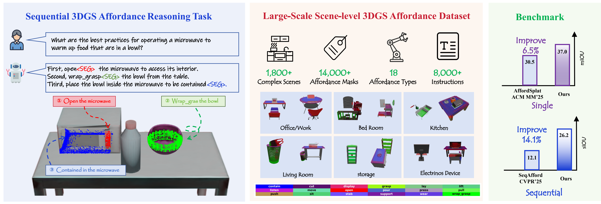

# SeqAffordSplat: Scene-level Sequential Affordance Reasoning on 3D Gaussian Splatting

<p align="center">
  <a href="https://arxiv.org/abs/2507.23772"></a>
  <a href="#citation"></a>
</p>

This is the official repository for the paper:

> **SeqAffordSplat: Scene-level Sequential Affordance Reasoning on 3D Gaussian Splatting**
> Di Li, Jie Feng\*, Jiahao Chen\*, Weisheng Dong, Guanbin Li, Yuhui Zheng, Mingtao Feng, Guangming Shi
> *Xidian University · Sun Yat-sen University · Qinghai Normal University*
> arXiv: [2507.23772](https://arxiv.org/abs/2507.23772)

---

## 🔥 Teaser

<p align="center">
  
</p>

We propose **Sequential 3DGS Affordance Reasoning** — a new task for long-horizon, multi-step interactions in 3D Gaussian scenes. We release **SeqAffordSplat**, the first large-scale benchmark of its kind (**1,800+ scenes, 14,000+ masks, 8,000+ sequential instructions**), and **SeqSplatNet**, an end-to-end LLM + 3DGS framework that improves prior SOTA by **6.5%** on single-step and **14.1%** on sequential tasks.

---

## 📥 Dataset Access

The SeqAffordSplat dataset is distributed on request.

> ✉️ To obtain the dataset, please email **[dili@stu.xidian.edu.cn](mailto:dili@stu.xidian.edu.cn)** with a short description of your research purpose and affiliation.

---

## 🛠️ Code & Models

> ⏳ **Code and pretrained checkpoints will be released soon.** Watch this repo for updates.

In the meantime, please refer to the paper for method details and use the email above to obtain the dataset.

---

## 🗂️ Repository layout

```
SeqAffordSplat/
├── README.md    ← you are here
└── teaser.png   ← Figure 1 / Figure 2
```

---

## 🧾 Citation

```bibtex
@article{li2025seqaffordsplat,
  title   = {SeqAffordSplat: Scene-level Sequential Affordance Reasoning on 3D Gaussian Splatting},
  author  = {Li, Di and Feng, Jie and Chen, Jiahao and Dong, Weisheng and Li, Guanbin and Zheng, Yuhui and Feng, Mingtao and Shi, Guangming},
  journal = {arXiv preprint arXiv:2507.23772},
  year    = {2025},
  url     = {https://arxiv.org/abs/2507.23772}
}
```

---

## 📬 Contact

Corresponding author: [dili@stu.xidian.edu.cn](mailto:dili@stu.xidian.edu.cn) (Di Li, Xidian University)
